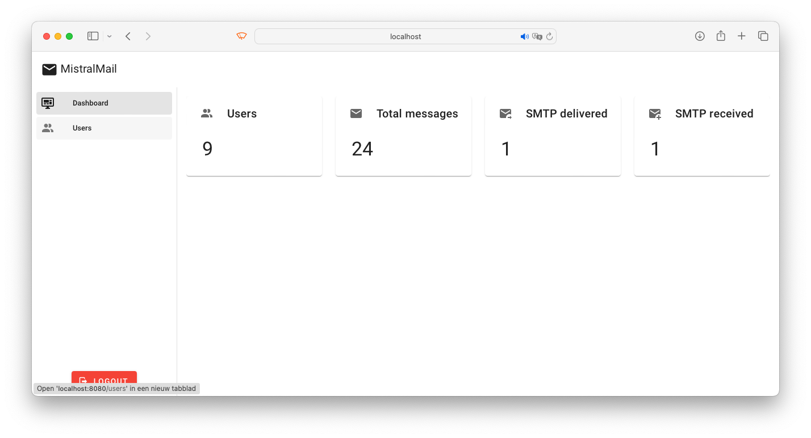

# MistralMail

MistralMail will be a production-ready, and easy to setup mail server. It consists of an SMTP server (both MSA and MTA) and an IMAP server all bundled in one executable (or just in one Docker image) with auto-generated TLS certificates.

⚠️ **WIP: MistralMail is far from being production-ready!** ⚠️


## Usage

### Setting up DNS records

MistralMail will not be able to generate TLS certificates without a correct DNS configuration. And of course you also won't be able to receive any emails. (But if you just want to configure it locally you can set `TLS_DISABLE` to `true` and skip this section.)

You need the following DNS records:

- A record `imap.yourdomain.com` pointing to your MistralMail server ip.
- A record `mx.yourdomain.com` pointing to your MistralMail server ip.
- A record `smtp.yourdomain.com` pointing to your MistralMail server ip.
- MX record point to `mx.yourdomain.com`.
- SPF record pointing to your SMTP relay provider.

### Running the MistralMail server

First you need to copy `.env.sample` to `.env` and configure all the needed environment variables.

Make sure that ports 80 and 443 are opened for the automatic TLS certificate generation via Let's Encrypt.

Then you can run the Go main manually or with Docker.

**Go:**

```bash
source .env
go run cmd/mistralmail/*.go
```

**Docker:**

Everything needed is put into the `docker-compose.yml` file.
If you don't want to build the image yourself you can use the prebuilt one present at `denbeke/mistralmail`.

```bash
docker-compose up mistralmail
```

Now you can create a user with the MistralMail CLI.

MistralMail exposes the following ports:

- `25` for all incoming SMTP emails (MTA)

- `587` for all outing SMTP emails (MSA)

- `143` for IMAP

- `443` & `80` for Let's Encrypt

- `9000` for the metrics

- `8080` for the api & web server

### Using the MistralMail Web UI

MistralMail comes with a basic web ui `http://localhost:8080`.
At the moment it supports nothing more than basic user management and basic statistics.



### Using the MistralMail command line interface

You can use the MistralMail command line interface with Go or with Docker:

```bash
go run cmd/mistralmail-cli/*.go
```

or

```bash
docker-compose run mistralmail mistralmail-cli
```

Currently the CLI contains the following commands:

- `create-user`: to create a new user.

- `reset-password` to reset the password of a user.

### Configuring your mail client

**IMAP:**

- **Server address:** `imap.yourdomain.com`

- **Username:** your email address

- **Port:** 143

- **Security:** STARTTLS

- **Authentication:** password

**SMTP:**

- **Server address:** `smtp.yourdomain.com`

- **Username:** your email address

- **Port:** 587

- **Security:** STARTTLS

- **Authentication:** password


Now you're all good to go!


## Development

We use `go work` for updating files across multiple repo's:

```bash
go work init
go work use smtp
go work use imap-backend
```


## Current state of MistralMail

### SMTP server

The SMTP server is completely custom written and can be found here: [mistralmail/smtp](https://github.com/mistralmail/smtp). It was written quite a while ago but it seems robust enough for now.

For outgoing emails we currently only support using an external relay like Mailgun or Sendgrid since we don't want to put too much time into debugging an MSA.

### IMAP

For IMAP we wrote a SQL backend behind [go-imap](https://github.com/emersion/go-imap). It supports MySQL, Postgres and Sqlite. (Currently only Sqlite has actually been tested.)

This backend is very experimental and surely contains a lot of bug. The backend is also implemented in a very non-performant way. So don't expect that MistralMail will be able to handle large inboxes at its current state.

We dump the complete emails in the database at this moment. In the future we would like to add support for object storage for the actual mail bodies. But that's nothing for the near future.

### Webmail

Currently there are no concrete plans to implement a webmail. But wouldn't it be nice to have it someday?

### Web management

Instead of configuring everything via a CLI, it's also possible to use the very basic web ui. But this is still very basic.

### SPAM

Another feature we are also not working on currently is anti-spam. Only SPF is checked at the moment. But nothing else.  
A very basic `X-Spam-Score` header can be enabled by setting `SPAM_CHECK_ENABLE` to `true`. It is disabled by default because it sends the incoming messages to the [Postmark Spam Check API](https://spamcheck.postmarkapp.com).


## Acknowledgements

* [Testify](https://github.com/stretchr/testify)
* [GoConvey](https://github.com/smartystreets/goconvey)
* [go-imap](https://github.com/emersion/go-imap)
* [logrus_sentry](https://github.com/evalphobia/logrus_sentry)


## Authors

[Mathias Beke](https://denbeke.be)
Timo Truyts
